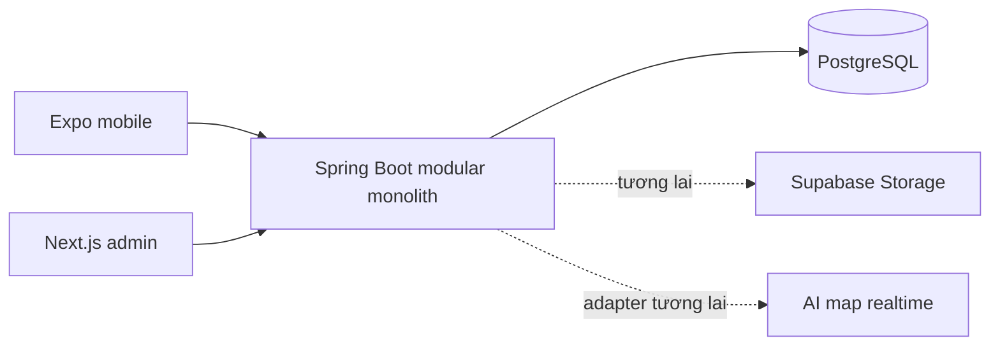

# Tổng quan kiến trúc VISTA

```mermaid
flowchart LR
  Mobile[Expo mobile] --> API[Spring Boot modular monolith]
  Admin[Next.js admin] --> API
  API --> PG[(PostgreSQL)]
  API -. tương lai .-> Storage[Supabase Storage]
  API -. adapter tương lai .-> External[AI map realtime]
```

Backend là biên tin cậy duy nhất cho dữ liệu riêng tư, authorization và business rule. Mobile/admin không truy cập trực tiếp bảng nghiệp vụ Supabase.
